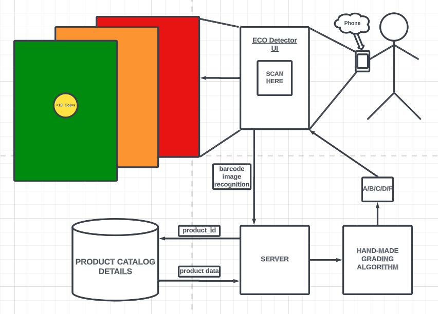

# Ecohack 2023 Hackathon - 1st Place Winner

Our app addressed the lack of awareness regarding the environmental impact of food products. We created under 24 hours a mobile application that empowers users to make environmentally conscious food choices by utilizing barcode scanning and product details data analysis. Our app provides instant feedback on a food product's environmental impact, helping consumers to make more conscious choices.

The application functions by scanning the barcode, sending the information to a server, getting an ID for the product, and running it through a grading algorithm. This algorithm considers various pre-defined parameters and weights to assess the product's environmental impact. The output is classified into multiple classes based on percentages, as we understand that the assessment cannot be determined in a binary way.

Based on the assessment, the application determines whether the product is eco-friendly or not. It then rewards users and recommends alternatives that align with their environmental values. These recommendations help users make more conscious choices when it comes to their food consumption.

### Preview

### Architecture

